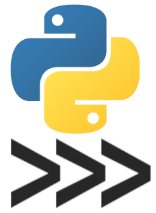

<br/><br/>

# Proyecto 2 - Lista de la compra


## Contenido

- [Proyecto 2 - Lista de la compra](#proyecto-2---lista-de-la-compra)
  - [Contenido](#contenido)
  - [Requisitos previos](#requisitos-previos)
  - [Temas relacionados con el proyecto](#temas-relacionados-con-el-proyecto)
  - [Convenciones](#convenciones)
  - [Objetivos](#objetivos)
  - [Introducción](#introducción)
  - [Actividades del proyecto](#actividades-del-proyecto)
    - [0: Descargar el proyecto y probar las funcionalidades](#0-descargar-el-proyecto-y-probar-las-funcionalidades)
    - [1. Lista de la compra](#1-lista-de-la-compra)
    - [2. Ordenación de la lista de la compra](#2-ordenación-de-la-lista-de-la-compra)
    - [3. Menú de selección](#3-menú-de-selección)
    - [4. Refactorización del código](#4-refactorización-del-código)
    - [5. Tareas opcionales](#5-tareas-opcionales)
  - [Evaluación](#evaluación)
  - [Entrega del proyecto](#entrega-del-proyecto)
  - [Enlaces](#enlaces)

## Requisitos previos

Disponer de una versión de Python igual o superior a 3.10, y del entorno de desarrollo Visual Studio Code.

## Temas relacionados con el proyecto

En la realización de este proyecto se ponen en práctica conceptos de los temas 1, 2, 3, 4, 5 y 6 de la asignatura. Además, se
utilizarán tangencialmente algunos elementos de temas posteriores.

## Convenciones

Durante el proyecto se utilizarán tres tipos de código. Por un lado, código a escribir en la línea de comandos
(_command line_), también conocida como terminal o consola. En el ejemplo de abajo, vemos cómo ejecutamos
el comando `python --version`, que imprime por pantalla la versión de Python en el sistema.


```shell
$ python --version
Python 3.10.12
```

Por otro lado, hay fragmentos de sesión del intérprete de comandos de python.
Podemos acceder al intérprete directamente ejecutando el comando Python en nuestra terminal:


```shell
$ python
Python 3.10.12 (main, Jun 11 2023, 05:26:28) [GCC 11.4.0] on linux
Type "help", "copyright", "credits" or "license" for more information.
>>> 
```

En este punto, podemos empezar a introducir nuestro código Python.
Las líneas introducidas por el usuario son las que empiezan con "`>>>`" o "`...`", como en el ejemplo siguiente:



```pycon
>>> a = 2
>>> for i in range(a):
...     print(i)
...
0
1
```

Finalmente, habrá código de ejemplo a guardar en un fichero de texto:


```python
def funcion(parametro):
   return
```

También utilizaremos etiquetas para resaltar consejos o aspectos importantes sobre ese producto:

_**Nota**: todas las líneas ejecutadas durante una sesión de python o de consola se guardan en el historial. Se puede acceder a una línea anterior mediante las flechas del teclado o pulsando `Ctrl+P` repetidamente hasta llegar a la línea deseada._

## Objetivos

-   Uso interactivo del intérprete de Python (REPL)
-   Uso básico de un IDE (Visual Studio Code) para desarrollar y ejecutar código
-   Creación, modificación y recorrido de listas
-   Uso de diccionarios
-   Uso de funciones con argumentos opcionales

## Introducción

El objetivo de este proyecto es desarrollar un gestor de la lista de la compra que nos permita tener una lista de productos que queremos comprar.

En el primer proyecto se desarrolló una versión inicial muy simple de este gestor.
Este proyecto consistirá en la ampliación del gestor de la lista de la compra con varias funciones.

## Actividades del proyecto

### 0: Descargar el proyecto y probar las funcionalidades

El primer paso para desarrollar el proyecto es descargar los ficheros necesarios del repositorio de Github.
El método más sencillo es a través del botón `Code->Download ZIP`.
Los dos ficheros necesarios para el proyecto son `listadelacompra.py` y `test.py`.
Las funciones desarrolladas deben estar contenidas en el fichero python con el nombre `listadelacompra.py` (que será el fichero que se debe entregar en Moodle). Este fichero se puede descargar del repositorio Github del proyecto, y contiene la cabecera de las funciones a desarrollar, así como la declaración de la lista `productos`.

Para su edición, se puede usar cualquier IDE, aunque se recomienda Visual Studio Code. Para comprobar las soluciones, se proponen dos opciones. Por un lado, el fichero de plantilla incluye una
función, `prueba_manual`, que ejecuta una serie de instrucciones para probar la funcionalidad. Este es un ejemplo de la salida cuando no se ha implementado ninguna función:

```
Insertando 3 productos
Traceback (most recent call last):
  File "../listadelacompra.py", line 125, in <module>
    prueba_manual()
  File "../listadelacompra.py", line 93, in prueba_manual
    insertar('Desmaquillante', 4.5, ('fiesta', 'teatro'), 'Cosméticos', 5)
  File "../listadelacompra.py", line 15, in insertar
    raise NotImplementedError
NotImplementedError
```

La otra opción, es mediante el fichero `test.py`. Este fichero se puede usar opcionalmente para comprobar que las funciones desarrolladas en el proyecto funcionan correctamente, como veremos más adelante.

### 1. Lista de la compra

El gestor de lista de la compra que definimos en el proyecto anterior permitía productos con un formato muy sencillo: únicamente un título. 
En este proyecto, vamos a ampliarlo para representar cada producto como un diccionario con los siguientes elementos:

- `nombre` del producto (como en el proyecto anterior)
- `precio` del producto
- `categoría`, categoría  del producto (puede usarse la palabra con o sin tilde, ya que no se comprueba en los tests)
- `etiquetas` tupla con posibles etiquetas que se les pueda dar al producto (p.e., etiquetas, subcategorías, etc.)
- `prioridad` (entero), que indica en un rango de 1 a 5 la urgencia con la que comprar este producto, siendo 1 muy poco urgente y 5 muy urgente
- `comprado` (booleano) que indica si el producto ha sido comprado o no

Un posible ejemplo de producto sería:


```python
producto = {
  "nombre": "Arroz integral",
  "precio": 0.72,
  "categoría": "Alimentación",
  "etiquetas": ("risotto", "arroz a la cubana"),
  "prioridad": 3,
  "comprado": False
}
```

Las funciones a implementar para el gestor de la lista de la compra serían las siguientes:


```python

productos: list[dict] = []

def insertar(nombre: str, precio: float | int, categoria: str, etiquetas: list[str]=[], prioridad: int=3):
    '''Añade un producto nuevo a la lista con los parámetros dados'''
    raise NotImplementedError

def borrar(indice: int):
    '''Borra de la lista el producto que se encuentra en la posición indicada'''
    raise NotImplementedError

def actualizar_precio(indice: int, precio: float):
    '''Actualiza el precio del producto con el índice dado'''
    raise NotImplementedError

def cambiar_estado(indice: int):
    '''Cambia el estado del producto con el índice dado entre comprado o no'''
    raise NotImplementedError

def mostrar_productos(comprados: bool=True, etiquetas: list[str]=[], categorias: list[str]=[]):
    '''
    Muestra por pantalla todos los productos con su información. Si un producto ya ha sido comprado, se marca con una x al comienzo.
    La prioridad se indicará mediante el uso de asteriscos (*), es decir, un artículo con prioridad 5 se representará mediante cinco asteriscos (*****).
    Si comprados es False, no se muestran los productos ya comprados.
    etiquetas es una tupla o lista con etiquetas o aclaraciones.
    Si está vacía, se muestran todos los productos. Si contiene alguna etiqueta, sólo se muestran los productos que tengan todas las etiquetas proporcionadas.
     Categorias es una lista con las categorías que se quieren obtener. Si está vacía, se muestran todos los productos. Si contiene alguna categoría, solo se muestran los productos cuya categoría esté contenida en la lista.

    Ejemplo en que sólo un producto ha sido comprado:
    >>> mostrar_productos()
    [x] Alimentación - Arroz integral - *** - 0.72 € - #risotto #arroz a la cubana
    [ ] Alimentación - Huevos - * - 1.20 € - #arroz a la cubana #tortilla 
    [ ] Cosméticos - Desmaquillante - ***** - 4.50 € - #fiesta #teatro

    >>> mostrar_productos(etiquetas=('arroz a la cubana'))
    [x] Alimentación - Arroz integral - *** - 0.72 € - #risotto #arroz a la cubana
    [ ] Alimentación - Huevos - * - 1.20 € - #arroz a la cubana #tortilla
    '''
    raise NotImplementedError
```

En cada uno de estos casos, habrá que sustituir la lı́nea `raise NotImplementedError` por el código necesario para cumplir la funcionalidad.

_**Nota:** en temas posteriores, veremos formas más eficientes de representar información mediante la definición de clases. Otra opción para representar tareas podría ser utilizar una tupla especial con nombres para cada posición (namedtuple <sup>[1](#namedtuple)</sup>)_


Para evitar tener que escribir excesivamente comprobar el funcionamiento de esta función, se recomienda crear una función de prueba, como por ejemplo:


```python

def prueba_1():
    print('-- Debería estar vacía')
    mostrar_productos()
    insertar('Garganzos', 0.68, 'Alimentación', ['cocido', 'humus'], 3)
    insertar('Hierbabuena', 1.5, 'Alimentación', ['coctainls'], 1)
    print('-- Debería mostrar Garganzos y hierbabuena')
    mostrar_productos()
    cambiar_estado(1)
    print('-- Debería mostrar Garbanzos como comprados')
    mostrar_productos()
    borrar(0)
    print('-- Debería mostrar sólo Hierbabuena')
    mostrar_productos()
```

### 2. Ordenación de la lista de la compra

Cuando la lista de la compra es grande, es interesante que se muestren en un orden especı́fico, y no sólo por orden de inserción.
Para ello, vamos a utilizar un algoritmo de ordenación conocido como Insertion Sort<sup>[2](#insertion_sort)</sup>, que comparará la prioridad de cada artículo y los colocará en el orden adecuado.
El criterio de ordenación será el siguiente: un producto ha de aparecer antes que otro si su prioridad es **mayor**, o si el primer producto no ha sido comprado y el segundo sí.

El funcionamiento de Insertion Sort es muy sencillo: consiste en ir cogiendo uno por uno los elementos de una lista y moverlos a su posición correspondiente con respecto a los anteriormente ordenados.
Así, empieza con el segundo elemento y lo ordena con respecto al primero.
Luego sigue con el tercero y lo coloca en su posición ordenada con respecto a los dos anteriores, y así sucesivamente hasta recorrer todas las posiciones de la lista.


```python
def ordenar():
    '''Ordena la lista de productos en función de su prioridad, y de si han sido ya comprados o no.'''
    raise NotImplementedError
```

Para probar este apartado, podemos de nuevo hacer una función específica:


```python

def prueba_2():
    productos.clear()
    insertar('Hierbabuena', 1.5, 'Alimentación', ['coctainls'], 1)
    insertar('Garganzos', 0.68, 'Alimentación', ['cocido', 'humus'], 3)
    print('-- Debería mostrar hierbabuena antes que garbanzos, porque se insertó antes')
    mostrar_productos()
  
    ordenar()
    print('-- Debería mostrar Garganzos antes, porque tiene prioridad mayor')
    mostrar_productos()
    cambiar_estado(0)
    print('-- Debería mostrar Hierbabuena antes, porque no está comprada')
    mostrar_productos()
```

### 3. Menú de selección

En el proyecto anterior creamos un menú interactivo utilizando varias sentencias de control.
En este proyecto, simplificaremos esta implementación mediante un diccionario.
Esto nos permitirá además añadir fácilmente una función de ayuda, que mostrará todos los comandos disponibles y la documentación de la función python que se usa en el comando.
En particular, implementaremos los siguientes comandos:

-  `mostrar`
-  `insertar <nombre>; <precio>; <categoria>; <etiquetas separadas por comas>; <prioridad>`
-  `borrar <indice>`
-  `precio <numero>; <precio>`
-  `comprado <numero>`
-  `ayuda`
-  `salir`

Los cinco primeros comandos harán uso de las funciones definidas anteriormente. El comando `ayuda` mostrará una lista de todos los comandos disponibles, y el comando `salir` detendrá la ejecución del programa. En los comandos que admiten varios argumentos, estos van separados por punto y coma (;).

Para implementar este menú, usaremos un diccionario de comandos a funciones, como el siguiente:


```python
{
  "mostrar": mostrar_productos,
  "insertar": insertar,
  "borrar": borrar,
  "ordenar": ordenar,
  "actualizar": actualizar_precio,
  "comprado": cambiar_estado,
}
```

Cada vez que el usuario lance un comando, el menú comprobará si hay una acción definida y, de ser ası́, la lanzará con los argumentos proporcionados.
En caso de insertar un comando no reconocido, el menú mostrará un texto de ayuda, que incluirá todas las acciones definidas junto con su documentación.
La documentación de una función (p.e., `mostrar_productos`) se puede obtener de la siguiente manera:


```pycon
>>> mostrar_productos.__doc__.strip()
```

Por último, podemos ver que no todas las funciones tienen el mismo número de parámetros.
Afortunadamente, Python permite lanzar una función con una serie de argumentos contenidos en una lista.
Para ello sólo tenemos que utilizar un asterisco antes de la lista que contiene los parámetros. Por ejemplo, el siguiente código:


```pycon
>>> args = ['Desmaquillante', 4.5, 'Cosméticos', ('fiesta', 'teatro'), 3, False]
>>> insertar(*args)
```

es equivalente a:


```python
insertar('Desmaquillante', 4.5, 'Cosméticos', ('fiesta', 'teatro'), 3, False)
```

Por lo tanto, algunos posibles ejemplos del uso de este menú serían:

```
-> mostrar
-> insertar Garbanzos; 0.68; Alimentación; cocido,hummus; 3
-> insertar Hierbabuena; 1.5; Alimentación; cocktails;  1
-> mostrar
[ ] Alimentación - Garbanzos - *** - 0.68 € - #cocido #hummus
[ ] Alimentación - Hierbabuena - * - 1.5 € - #cocktails
-> comprado 0
-> mostrar
[x] Alimentación - Garbanzos - *** - 0.68 € - #cocido #hummus
[ ] Alimentación - Hierbabuena - * - 1.5 € - #cocktails
```

_**Nota:** Los argumentos de los comandos son cadenas de texto.
En algunos de los comandos (insertar, comprado o actualizar), será necesario convertirlos a enteros, float o tupla.
La forma más fácil de pasar a formato numérico en nuestro caso es utilizar `numero = int(numero)` o `numero = float(numero)` dentro de la función que corresponda.
En el caso de las tuplas, lo que haremos será detectar si la entrada es una cadena de texto, y en ese caso separaremos por comas._


### 4. Refactorización del código
Ahora, vamos a llevar a cabo una refactorización del código con el objetivo de hacerlo más claro y eficiente. Para ello, crearemos un nuevo fichero ``listadelacompra_clases.py`` en el que crearemos dos clases (``ListaCompra`` y ``Producto``) que agruparán las funciones desarrolladas anteriormente. 

La clase ``Producto`` ha de tener un constructor que reciba todos los parámetros necesarios para la creación de un producto (``nombre``, ``precio``, ``categorias``, ``etiquetas``, ``prioridad``), y los inicialice como atributos. Considere qué puede haber parámetros opcionales, decida cuáles podrían ser y qué valor por defecto deberían tener. Además, debe inicializar el atributo ``comprado`` a False.

La clase ``ListaCompra`` debe contener un constructor que inicialice su único atributo: ``productos`` (una lista de objetos de la clase ``Producto``). Además, debe contener todos los métodos necesarios para realizar las operaciones: ``insertar``, ``borrar``, ``actualizar_precio``, ``ordenar``,  ``cambiar_estado`` y ``mostrar_productos``, con sus respectivos parámetros.

Por último, el menú deberá operar con ambas clases en lugar de llamar directamente a las funciones desarrolladas en los puntos anteriores.

Este último punto del proyecto 2 es **obligatorio** para considerar terminado el proyecto 2. Es decir, que es necesario para su evaluación en el examen práctico. En otras palabras, aunque se realice la primera parte (sin clases) en el fichero ``listadelacompra.py``; se debe completar este úlitmo punto y desarrollar también la versión usando las clases ``ListaCompra`` y ``Producto`` en el fichero ``listadelacompra_clases.py``.

### 5. Tareas opcionales

Como hemos dicho, hemos realizado una gestión muy básica de la lista de la compra. Por ello, se propone realizar
libremente las siguientes tareas para mejorar en el manejo de Python y obtener una gestión de lista de la compra más
útil:

- Permitir varias listas de la compra.
  Con la clase ``ListaCompra`` puede crear tantos objetos como listas de la compra necesite (para diferentes supermercados o diferentes temáticas). Por lo que puede hacer que el menú permita la creación y el uso de diferentes listas.
- Modificar el menú para que los argumentos se pidan uno a uno de manera interactiva, en lugar de escribirlos con separadores en la misma lı́nea.
 - Mostrar el ı́ndice de cada producto. Borrar o cambiar un producto requiere saber el ı́ndice del producto en la lista.
 Serı́a útil que se mostrara el ı́ndice de cada producto junto con el resto de información.
 Existen varios enfoques para lograrlo.
 Una opción es incluir el ı́ndice en el producto, igual que hemos hecho con el resto de información, pero eso requiere modificar muchas partes del código.
 Una opción más elegante es usar la función `enumerate`, que además permite recorrer una lista (cualquier iterable) y devuelve uno a uno los elementos y su ı́ndice.
- Añadir una función que permita borrar o modificar productos por nombre en vez de por índice.

## Evaluación

En esta tarea se incluyen dos ficheros de pruebas llamados `test.py` y `test_clases.py`.
Su uso es opcional, pero muy recomendado, ya que permite comprobar de una manera estructurada si las funcionalidades pedidas se han implementado. Para que las pruebas se ejecuten correctamente, los ficheros de la solución deben tener el nombre `listadelacompra.py`  y `listadelacompra_clases.py`, y estar alojados en la misma carpeta que los ficheros de pruebas `test.py` y `test_clases.py`.

Los tests pueden lanzarse en cualquier momento en la línea de comando.
Si todo está bien implementado, debería obtenerse un resultado parecido a este:


```shell
 $ python test.py
.....
----------------------------------------------------------------------
Ran 7 tests in 0.000s

OK
```

Si existiera algún fallo en la implementación, obtendríamos un error:


```shell
$ python test.py
======================================================================
FAIL: test_cambiar (__main__.TestProductos)
----------------------------------------------------------------------
Traceback (most recent call last):
  File "test.py", line 54, in test_cambiar
    assert (nombre == 'Huevos') == comprado
AssertionError

======================================================================
FAIL: test_precio (__main__.TestProductos)
----------------------------------------------------------------------
Traceback (most recent call last):
  File "test.py", line 64, in test_precio
    assert (precio == 1.5) == (nombre == 'Arroz integral')
AssertionError

----------------------------------------------------------------------
Ran 7 tests in 0.001s

FAILED (failures=2)
```

## Entrega del proyecto 


Para entregar el proyecto, se deberá subir a Moodle en la tarea llamada "Entrega del proyecto 2" los ficheros `listadelacompra.py` y `listadelacompra_clases.py`.
Estos ficheros debe contener todas las funciones requeridas en el enunciado.
</br>

## Enlaces
<a hame="namedtuple">1</a> https://docs.python.org/3/library/collections.html </br>
<a name="insertion_sort">2</a>: https://en.wikipedia.org/wiki/Insertion_sort </br>
